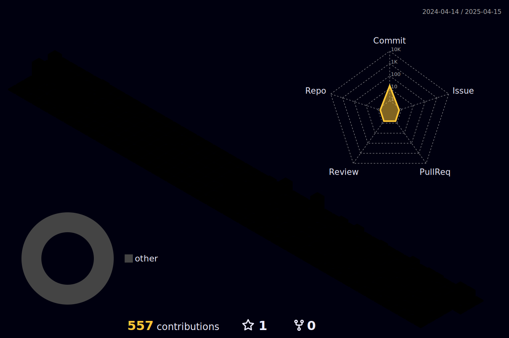

### Hi there 

I'm Web developer, I like sushi. :sushi:

<!-- :trophy: Github Stats -->

<!-- metrics -->

  <picture>
    <source media="(prefers-color-scheme: dark)" srcset="profile-metrics-output/metrics.base.svg" width="400" />
    <source media="(prefers-color-scheme: light)" srcset="profile-metrics-output/metrics.base.svg" width="400" />
    
  </picture>
  <picture>
   	<source media="(prefers-color-scheme: dark)" srcset="profile-metrics-output/details.svg" width="400" />
    <source media="(prefers-color-scheme: light)" srcset="profile-metrics-output/details.svg" width="400" />
    
  </picture>

<!-- habits -->

	<picture>
    <source media="(prefers-color-scheme: dark)" srcset="profile-metrics-output/metrics.plugin.habits.svg" width="800" />
    <source media="(prefers-color-scheme: light)" srcset="profile-metrics-output/metrics.plugin.habits.svg" width="800" />
    
	</picture>

<!-- 3d contrib -->

  <picture>
    <source media="(prefers-color-scheme: dark)" srcset="profile-3d-contrib/profile-night-rainbow.svg" width="800" />
    <source media="(prefers-color-scheme: light)" srcset="profile-3d-contrib/profile-night-rainbow.svg" width="800" />
    
  </picture>

<!-- anilist -->

  <picture>
    <source media="(prefers-color-scheme: dark)" srcset="profile-metrics-output/metrics.plugin.anilist.svg" width="800" />
    <source media="(prefers-color-scheme: light)" srcset="profile-metrics-output/metrics.plugin.anilist.svg" width="800" />
    
  </picture>

